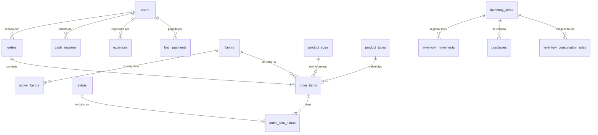

# Contexto de Negocio y Sistema - NEON Drinks & Snacks (NEON OS)

Este documento sirve como un manual de contexto completo para Gemini u otros agentes de IA que vayan a trabajar sobre la base de código de **NEON OS**. Contiene las reglas del negocio, el modelo financiero, el catálogo de productos, las fórmulas de inventario, el esquema técnico y los flujos operativos.

---

## 1. Visión General del Negocio y del Sistema

**NEON Drinks & Snacks** es un negocio de venta de raspados (granizados), bebidas y snacks, diseñado para operar en puntos físicos de alta afluencia (especialmente los fines de semana).

**NEON OS** es el sistema operativo del negocio. Se trata de una aplicación web **mobile-first, offline-first** optimizada para el flujo rápido de venta en horas pico. Sus características operativas clave son:
- **Flujo POS ágil**: Un proceso táctil de 6 pasos para registrar pedidos en menos de 10 segundos.
- **Interfaz nocturna / exterior**: Diseño oscuro con acentos de color neón contrastantes, con targets táctiles grandes para fácil uso al aire libre o bajo luz cambiante.
- **Operación Offline**: Permite registrar ventas, consumos e inventarios localmente (Zustand + LocalStorage) si la señal de red falla, y sincroniza automáticamente las transacciones con **Supabase** al detectar conexión.
- **Asignación Dinámica de Sabores (Tanques)**: Cuenta con un sistema físico de tanques (generalmente 3 tanques en servicio) donde cada día de operación se asigna qué sabor de jarabe está conectado a cada tanque.

---

## 2. Stack Tecnológico

La aplicación está construida sobre las siguientes tecnologías:
- **Framework**: Next.js 15 (App Router) + React 19 + TypeScript.
- **Base de Datos**: Supabase (PostgreSQL) con políticas de seguridad de nivel de fila (RLS).
- **Estilos**: Tailwind CSS + Shadcn/ui.
- **Manejo de Estado**: Zustand (con middleware de persistencia local en `LocalStorage`).
- **Lógica Financiera y de Fechas**: `date-fns` para cálculo de días comerciales y agregados.
- **Analíticas**: Recharts para visualizaciones de ventas y tendencias de stock.

---

## 3. Catálogo de Productos y Estructura de Precios

La oferta comercial se centra principalmente en **Raspados Base** que se personalizan según el tamaño, tipo de preparación y ingredientes adicionales (extras).

### A. Tipos de Raspado (Modificadores de Tipo)
Representados por la tabla `public.product_types`. Los tipos de raspado básicos y sus modificadores de precio/costo en la base de datos (según semilla) son:
1. **Básico (`basico`)**: Raspado estándar. Modificador precio: $0, Modificador costo: $0.
2. **Premium (`premium`)**: Ingredientes especiales. Modificador precio: +$2,500, Modificador costo: +$700.
3. **Cremoso (`cremoso`)**: Base cremosa especial de leche/crema. Modificador precio: +$7,000, Modificador costo: +$2,000.
4. **Picoso (`picoso`)**: Preparación picante (michelado). Modificador precio: +$5,000, Modificador costo: +$1,000.

### B. Tamaños del Producto
Representados por la tabla `public.product_sizes`.
1. **8 oz (`8oz`)**: Base de 8 onzas.
2. **12 oz (`12oz`)**: Base de 12 onzas.
3. **16 oz (`16oz`)**: Base de 16 onzas.

### C. Matriz de Precios Fija (`PRICE_MATRIX`)
A nivel de código en el POS (`lib/business.ts`), la lógica de facturación utiliza una matriz de precios fija (`PRICE_MATRIX`) que cruza el **Tipo de Raspado** con el **Tamaño**, sobreescribiendo los modificadores base si es necesario. La matriz configurada es la siguiente:

| Tipo (`product_types`) | 8 oz (`8oz`) | 12 oz (`12oz`) | 16 oz (`16oz`) |
| :--- | :---: | :---: | :---: |
| **Básico (`basico`)** | $5.000 | $8.000 | $10.000 |
| **Con Licor (`con-licor`)** | $7.000 | $10.000 | $15.000 |
| **Cremoso (`cremoso`)** | $8.000 | $13.000 | $17.000 |
| **Picoso (`picoso`)** | *No se vende* (null) | $13.000 | $15.000 |

*Nota: La combinación Picoso de 8 oz es inválida y el sistema no permite agregarla al carrito.*

### D. Adicionales (Extras)
Ingredientes extra que el cliente puede añadir al raspado base. Representados por la tabla `public.extras`.
- **Chamoy**: Precio venta $2.000 | Costo $500 (Deduce del inventario `Chamoy`)
- **Lengua** (Gomita de lengua): Precio venta $1.000 | Costo $300 (Deduce del inventario `Lengua`)
- **Perlas explosivas**: Precio venta $2.000 | Costo $600 (Deduce del inventario `Perlas explosivas`)
- **Gomitas enchiladas**: Precio venta $2.200 | Costo $650 (Deduce del inventario `Gomitas enchiladas`)
- **Jeringa con licor**: Precio venta $2.000 | Costo $1.000 (Deduce del inventario `Jeringa con licor`)
- **Jeringa de sirope**: Precio venta $1.000 | Costo $150 (Deduce del inventario `Jeringa de sirope`)
- **Chupeta**: Precio venta $1.000 | Costo $200 (Deduce del inventario `Chupeta`)

### E. Sabores (Flavors) y Sistema de Tanques
Cada raspado requiere seleccionar un sabor base. Los sabores son físicos y se despachan desde tanques:
1. **Chicle** (Color rosa `#ff73e3`, ligado a `Líquido Chicle`)
2. **Sandía** (Color turquesa `#3de8c2`, ligado a `Líquido Sandía`)
3. **Maracumango / Maracuyá** (Color amarillo `#ffd24d`, ligado a `Líquido Maracumango`)
4. **Limón** (Color verde `#7df97f`, ligado a `Líquido Limón`)

**Asignación de Tanques Comercial (`public.active_flavors`)**:
Durante cada día comercial, el administrador mapea qué sabor está cargado en qué tanque (del 1 al 3) para que el operador lo seleccione rápidamente. Solo 3 sabores pueden estar activos a la vez (uno por cada tanque físico).

---

## 4. Gestión de Inventarios y Deducción por Recetas

El inventario de insumos está clasificado en la tabla `public.inventory_items` con las siguientes categorías principales:
- `envases` (Vasos, pitillos, tapas)
- `extras` (Chamoy, perlas, gomitas adicionales, licores)
- `sabores` (Jarabes líquidos medidos en `ml` consumidos por los sabores)
- `insumos` (Gomitas base, chicles base, etc.)
- `produccion` (Bases preparadas)

### Reglas de Consumo de Inventario (`public.inventory_consumption_rules`)
El sistema no deduce inventario de manera arbitraria; sigue una tabla de recetas ligadas a la composición del ítem pedido.

Cuando se crea un ítem de pedido (`OrderItem`), el sistema determina qué insumos se restan basándose en la siguiente jerarquía:

1. **Deducción por Reglas (Recetas)**:
   Si existen reglas activas en `inventory_consumption_rules` que coincidan con el tipo, tamaño o extras del ítem:
   - Si la regla tiene `consumes_selected_flavor = true`, buscará el sabor seleccionado (`flavorId`) y restará la cantidad del insumo líquido asociado a ese sabor (por ejemplo, restar `50 ml` del `Líquido Chicle` si el sabor es Chicle).
   - Si no consume sabor dinámico, restará la cantidad especificada de la columna `inventory_item_id`.
   - **Ejemplo de Receta Base 8 oz (Básico)**:
     - Consume sabor dinámico (1 porción del sabor seleccionado).
     - 1 Vaso de 8 oz.
     - 2 unidades de Gomitas.
     - 1 Chicle de cuadrito.
     - 1 Chupeta.
     - 1 Pitillo.
   - **Ejemplo de Receta Cremoso 16 oz**:
     - Consume sabor dinámico.
     - 1 Vaso especial transparente de 16 oz.

2. **Deducción Alternativa (Fallback)**:
   Si no se configuran reglas específicas de consumo en la base de datos, el sistema ejecutará un descuento directo:
   - Se descuenta 1 unidad del insumo configurado directamente en el tamaño del producto (`ProductSize.inventoryItemId`), típicamente el vaso de ese tamaño.
   - Para cada ingrediente extra seleccionado en el pedido, se descuenta 1 unidad del insumo ligado a dicho extra (`Extra.inventoryItemId`).

### Movimientos de Inventario (`public.inventory_movements`)
Cada cambio en el stock físico se registra como un movimiento asociado a un tipo:
- `sale` (Deducción automática al registrar un pedido).
- `purchase` (Aumento de stock por compra a proveedor).
- `adjustment` (Corrección manual del administrador).
- `waste` (Pérdidas de insumos por daño o vencimiento, restan stock).

---

## 5. Modelo Financiero y Contabilidad

El flujo financiero es fundamental para la toma de decisiones. El sistema realiza la consolidación diaria basada en tres elementos de flujo de caja y rentabilidad:

### A. Control de Caja (Sesiones de Caja / Arqueos)
Permite a los operadores abrir y cerrar turnos físicos asegurando que el dinero real coincida con el registrado.
- **Apertura**: El operador inicia sesión registrando el dinero base en efectivo (`openingCash`).
- **Cálculo de Ventas en Efectivo**: El sistema calcula la suma de todos los pedidos pagados con el método `cash` (efectivo) creados **después** de la fecha de apertura de la sesión activa:
  $$\text{Ventas en Efectivo} = \sum \text{Total de Pedidos en Efectivo despues de la Apertura}$$
- **Dinero Esperado**: 
  $$\text{Expected Cash} = \text{openingCash} + \text{Ventas en Efectivo}$$
- **Cierre / Diferencia**: Al cerrar el turno, el operador cuenta el efectivo real en caja e ingresa el monto total (`closingCash`). El sistema calcula el descuadre (diferencia):
  $$\text{Diferencia} = \text{closingCash} - \text{Expected Cash}$$
  - Si la diferencia es menor a 0, hay un faltante de caja.
  - Si es mayor a 0, hay un sobrante de caja.

*Nota: Los pagos electrónicos (como `nequi` u otros pagos digitales) no se suman para el arqueo de efectivo físico de la caja, pero sí se consolidan en las ventas generales del negocio.*

### B. Costo de Ventas (COGS) y Rentabilidad Comercial
Cada ítem en el pedido calcula y almacena el costo unitario de su preparación:
- **Costo Unitario del Raspado**:
  $$\text{Unit Cost} = \text{Costo Base del Tamaño} + \text{Costo Modificador del Tipo} + \sum \text{Costo de Extras Seleccionados}$$
  - *Ejemplo*: Raspado básico de 12 oz (Costo Base $1.600) + Extra Perlas (Costo Extra $600) = Costo Unitario $2.200.
- **Costo de Ventas Total (COGS)**: Sumatoria de los costos estimados por la cantidad de cada raspado vendido.

### C. Gastos Operativos (`public.expenses`)
Salidas directas de caja para mantener operando el negocio. Registran un concepto (ej. "Hielo extra", "Fruta del mercado"), monto (`amount`) y categoría (ej. "operación", "servicios").

### D. Abonos a Préstamos (`public.loan_payments`)
Representa amortizaciones de deudas del negocio a prestamistas o socios. Almacena el nombre del prestamista/socio (`lender`), el monto pagado (`amount`) y el saldo restante de la deuda tras el abono (`balanceAfterPayment`).

### E. Cálculo de Utilidad Mensual
En la sección de analíticas (`lib/analytics.ts`), el sistema calcula la salud financiera mensual del negocio bajo dos márgenes utilizando la siguiente lógica:

1. **Ingresos (Revenue)**: Ventas brutas totales del mes (sin importar el método de pago).
2. **COGS**: Costo estimado total de insumos vendidos en el mes.
3. **Gastos del Mes (Expenses)**: Sumatoria de gastos registrados en el periodo.
4. **Préstamos del Mes (Loans)**: Sumatoria de abonos a deudas pagados en el periodo.
5. **Utilidad Bruta (Gross Profit)**:
   $$\text{Gross Profit} = \text{Revenue} - \text{COGS}$$
6. **Utilidad Neta (Net Profit)**:
   *Nota importante: Operativamente el negocio resta los abonos de préstamos directamente del flujo de caja del mes para obtener la utilidad neta líquida.*
   $$\text{Net Profit} = \text{Revenue} - \text{COGS} - \text{Gastos} - \text{Abonos a Préstamos}$$

---

## 6. Sincronización y Ciclo de Vida de Transacciones

Dado que NEON OS funciona en exteriores (parques, festivales) donde la señal celular falla, cuenta con un protocolo estricto de resiliencia de datos:

1. **Modo Demo (Offline de Prueba)**:
   Si las variables de entorno de Supabase no están configuradas, el sistema arranca usando `lib/demo-data.ts` para precargar datos directamente en Zustand y LocalStorage, permitiendo probar toda la app sin persistencia en la nube.
2. **Registro de Pedido (Modo Producción)**:
   - El POS consulta `/api/orders/next-number` para obtener la secuencia persistente y generar el número de orden (ej. `N-0024`).
   - Se crea el registro del pedido con `syncState = 'pending'`.
   - Se inserta en el almacenamiento del cliente (`Zustand` store y local storage).
   - Se recalculan inmediatamente los inventarios de forma reactiva en el dispositivo reduciendo los stocks locales.
   - Si hay señal (`navigator.onLine` es true), intenta hacer POST de inmediato a `/api/orders` para guardar la orden, sus ítems y sus extras en Supabase en una sola transacción.
   - Si la petición es exitosa, actualiza el estado local del pedido a `syncState = 'synced'`.
3. **Cola de Sincronización**:
   Si el POST falla por pérdida de red, el pedido queda como `pending` de forma indefinida en el local storage. Cuando la aplicación detecta reconexión, procesa los pedidos pendientes en orden cronológico y los sincroniza contra el backend remoto en lotes.

---

## 7. Referencia de la Base de Datos

Las tablas y relaciones del sistema en Supabase se estructuran así:

### Constraints Críticos de Integridad:
- **`active_flavors`**: Llave única compuesta por `(business_date, tank_number)` y `(business_date, flavor_id)`. Asegura que no haya dos sabores en el mismo tanque el mismo día, ni el mismo sabor asignado a múltiples tanques.
- **`payment_method`**: Limitado a `('cash', 'nequi', 'daviplata', 'transfer')` en base de datos.
- **`cash_sessions`**: Restringida a estados `('open', 'closed')`. Solo una sesión puede estar abierta simultáneamente a nivel de UI.

---

## 8. Directrices Generales para Escribir Código en NEON OS

Si eres un agente programando en este proyecto, sigue siempre estas reglas:

1. **Mantener la Coexistencia del Modo Demo**: No asumas que la base de datos de Supabase siempre responde. Si los endpoints devuelven un error o no hay conexión, la aplicación debe poder leer y escribir en el almacén de Zustand de forma limpia y transparente.
2. **Priorizar Integridad Financiera**: Los cálculos de dinero e inventario no se pueden aproximar descuidadamente. Los precios de venta del raspado deben validar primero contra la constante `PRICE_MATRIX` y sumarle los precios individuales de los adicionales (`extras`).
3. **Descuento de Inventario Preciso**: Siempre usa `calculateInventoryConsumptionDeltas` para calcular consumos. Si se agregan nuevos tipos de producto o extras, asegúrate de añadir las correspondientes reglas en la base de datos (`inventory_consumption_rules`) y en la inicialización del estado de demostración (`lib/demo-data.ts`).
4. **Convención de Fechas**: Las fechas comerciales del negocio se calculan por la función `getBusinessDate()` (que formatea la fecha actual al inicio del día como ISO YYYY-MM-DD). La comparación de cierres de caja o asignación de sabores siempre debe alinearse con esta fecha de negocio y no con la zona horaria del servidor.
5. **No romper Next.js 15 / React 19**: Presta atención a las APIs asíncronas de enrutamiento y el soporte de componentes de servidor/cliente según el estándar moderno usado en el proyecto.
